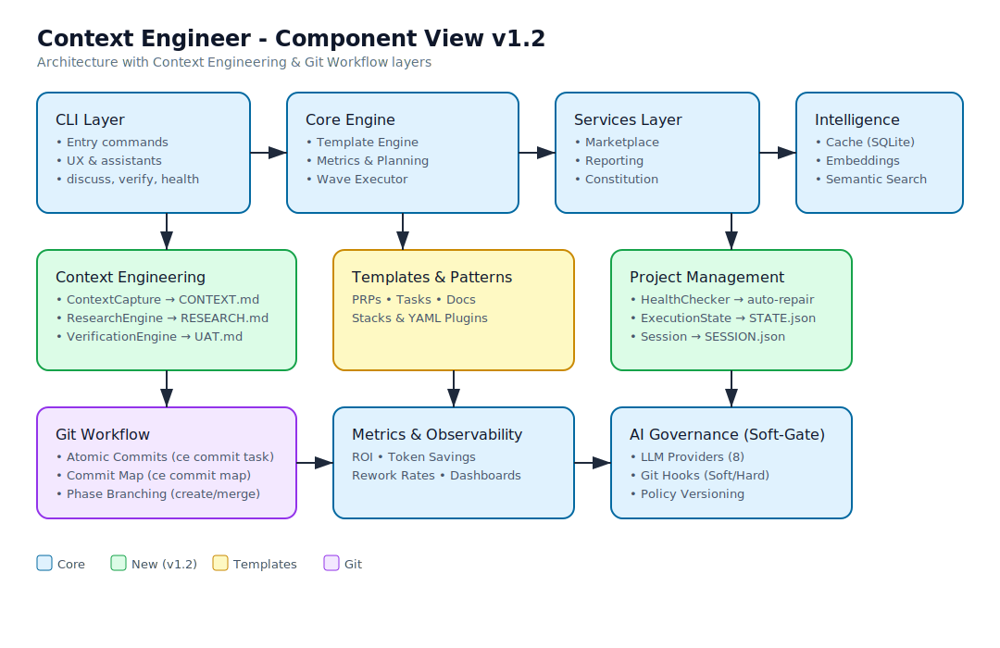
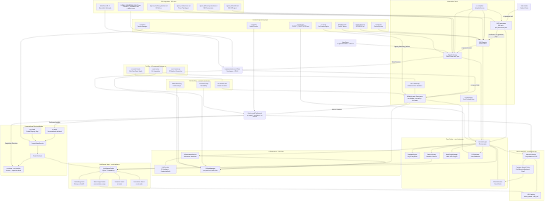

# Context Engineer - AI-Assisted Development Framework

> **Language Navigation / Navegação**
> 1. [English Reference](#english-reference)
> 2. [Referência em Português](#referencia-em-portugues)
>
> **Language note:** `@Agente_PRD_360.md` now asks which language to use (EN-US or PT-BR) before generating any PRD/JSON output. Keep both language versions of your docs handy so the agent can mirror the user's choice.

---

## English Reference

### Overview
- Context Engineer is an AI-assisted delivery framework that converts **ideas → PRD → PRPs → Tasks → Production-ready code** using IDE prompts plus the `ce` CLI.
- Clean Architecture, SOLID, LGPD compliance, automated validation and estimation are enforced by default.
- Works with AI copilots (semantic embeddings via `--ai`) or in lightweight mode (`--no-ai`), with governance handled by Soft-Gate Git hooks.

#### Architecture

#### Pipeline Flow

### Installation & Environment
| Scenario | Command(s) |
|----------|------------|
| Fast path | `uv pip install context-engineer` (+ `"context-engineer[ai]"` for semantic search) |
| Classic pip | `pip install context-engineer` |
| Contributors | `git clone ... && uv pip install -e .` |
| Sync IDE prompts | `ce ide sync --project-dir . --target-dir .ide-rules` |

### Terminal Interaction Tracks
| Track | Command(s) | Purpose |
|-------|------------|---------|
| Conversational assistant | `ce assist --format text\|html --open` | Reads project state, suggests patterns/cache entries and can execute `ce init`, `ce generate-prd`, `ce generate-prps`, `ce generate-tasks`. |
| Review / inspection | `ce status`, `ce checklist` | Read-only dashboards for governance ceremonies. |
| Guided / automation | `ce wizard`, `ce autopilot`, `ce ci-bootstrap` | Wizard confirms each phase; Autopilot resumes unattended pipelines; CI bootstrap wires `ce validate` + `ce report` into GitHub Actions. |
| Context & planning | `ce discuss <phase>`, `ce verify <phase>` | Capture decisions before planning; run verification/UAT after execution. |
| Project management | `ce state status`, `ce health`, `ce session pause/resume` | Track state, diagnose project integrity, manage work sessions. |
| Git workflow | `ce commit task <id> <msg>`, `ce commit map` | Atomic commits per task and commit-to-task traceability. |

### Getting Started
1. `ce init my-project --stack python-fastapi` or `ce init --interactive`.
2. `ce ide sync --project-dir .` to copy/distribute prompts/workflows (fallback to `cp -r IDE-rules .ide-rules` only if the command is unavailable) and configure `GLOBAL_ENGINEERING_RULES.json` + `PROJECT_STANDARDS.md`. Remember: `@Agente_PRD_360.md` will prompt for the preferred language (EN-US/PT-BR) before producing the PRD.
3. Generate PRD (`@Agente_PRD_360.md`), PRPs (`@Agente_PRP_Orquestrador.md`), and Tasks (`@TASKs/TASK.FR-001.md` or `ce generate-tasks`).
4. Validate + report using `ce validate`, `ce report`, `ce checklist`, `ce status`, and run `ce doctor` for health-check (ROI/hooks).
5. Use the functional diagram (`docs/assets/context_engineer_flow.mmd` or the PNG fallback) to explain how ideas flow through governance.

### Documentation Map
- **CLI Commands Manual:** [`docs/CLI_COMMANDS.md`](docs/CLI_COMMANDS.md) - Complete reference of all CLI commands with examples (bilingual navigation)
- Full walkthrough: `docs/MAIN_USAGE_GUIDE.md` (bilingual navigation).
- Quick commands: `docs/QUICK_REFERENCE.md` (bilingual navigation).
- User Story fast-path: `docs/USER_STORY_QUICK_GUIDE.md` (bilingual navigation).
- Multi-IDE / no-AI flow: `docs/MULTI_IDE_USAGE_GUIDE.md` (bilingual navigation).
- AI Governance: `docs/AI_GOVERNANCE.md` (bilingual navigation).
- **Complete Technical Overview:** [`docs/FRAMEWORK_OVERVIEW.md`](docs/FRAMEWORK_OVERVIEW.md) — architecture, pipeline, IDE integration, token economy, metrics.
- Release checklist: `docs/MAIN_USAGE_GUIDE.md#release-checklist-pypi--github-actions`.

### Release Checklist (PyPI + GitHub Actions)
1. Run validations: `pytest -q && ruff check .` (plus stack-specific linters).
2. Diagnose AI stack: `ce doctor --format table [--ai-profile corporate]` and `ce ai-governance status --format table` to confirm ROI metrics and Git hook status.
3. Sync prompts/workflows: `ce ide sync --project-dir .` (commit `.ide-rules/` if the repository is shared).
4. Refresh CI workflow: `ce ci-bootstrap --project-dir .` whenever governance policies change.
5. Build & publish: `python -m build && twine upload dist/*`.
6. Tag & push: `git tag vX.Y.Z && git push --tags`.

### Key Features

- Clean Architecture + SOLID principles enforced
- Intelligent cache learning from previous projects
- Context Pruning (60-80% token reduction)
- Deep Cross-Validation (API ↔ UI contract detection)
- AI Governance with Soft-Gate system
- ROI Tracking with token savings metrics
- Stack Plugins: Add new stacks via YAML only
- Multi-stack support (Python/FastAPI, Go/Gin, Node/React, Vue3)
- Automated tests (≥ 80% coverage requirement)
- **Project Constitution** — Centralized principles and guidelines (`ce constitution init`)
- **Execution State** — Real-time progress tracking with `STATE.json` / `STATE.md`
- **Atomic Git Commits** — One commit per task for clean, traceable history
- **Wave-Based Execution** — Dependency-aware parallel task execution in waves
- **Research Phase** — Automated `RESEARCH.md` generation before planning
- **Context Capture** — Interactive discuss phase to clarify gray areas (`ce discuss`)
- **Verification & UAT** — Automated deliverable extraction and UAT checklists (`ce verify`)
- **Session Management** — Pause/resume work sessions preserving context
- **Health Checks** — Project integrity diagnosis and auto-repair (`ce health --repair`)
- **Git Branching Strategies** — Automatic phase/milestone branch management

### Contributing

1. Follow the rules in `GLOBAL_ENGINEERING_RULES.json`
2. Add tests for changes
3. Run validations: `pytest -q && ruff check .`
4. Use Conventional Commits

### License

This project is licensed under the [MIT License](LICENSE).

---

## Referência em Português

### Visão Geral
- Context Engineer é um framework de entrega assistido por IA que converte **ideias → PRD → PRPs → Tasks → Código pronto para produção** usando prompts de IDE mais a CLI `ce`.
- Clean Architecture, SOLID, conformidade LGPD, validação e estimativa automatizadas são aplicadas por padrão.
- Funciona com copilots de IA (embeddings semânticos via `--ai`) ou em modo leve (`--no-ai`), com governança gerenciada por Git hooks Soft-Gate.

#### Arquitetura

#### Diagrama de Fluxo

### Instalação e Ambiente
| Cenário | Comando(s) |
|---------|------------|
| Caminho rápido | `uv pip install context-engineer` (+ `"context-engineer[ai]"` para busca semântica) |
| Pip clássico | `pip install context-engineer` |
| Contribuidores | `git clone ... && uv pip install -e .` |
| Sincronizar prompts IDE | `ce ide sync --project-dir . --target-dir .ide-rules` |

### Trilhas de Interação no Terminal
| Trilha | Comando(s) | Propósito |
|--------|------------|-----------|
| Assistente conversacional | `ce assist --format text\|html --open` | Lê o estado do projeto, sugere padrões/entradas de cache e pode executar `ce init`, `ce generate-prd`, `ce generate-prps`, `ce generate-tasks`. |
| Revisão / inspeção | `ce status`, `ce checklist` | Dashboards somente leitura para cerimônias de governança. |
| Guiado / automação | `ce wizard`, `ce autopilot`, `ce ci-bootstrap` | Wizard confirma cada fase; Autopilot retoma pipelines sem supervisão; CI bootstrap integra `ce validate` + `ce report` no GitHub Actions. |
| Contexto e planejamento | `ce discuss <fase>`, `ce verify <fase>` | Captura decisões antes do planejamento; executa verificação/UAT após execução. |
| Gerenciamento de projeto | `ce state status`, `ce health`, `ce session pause/resume` | Rastreamento de estado, diagnóstico de integridade, gerenciamento de sessões. |
| Fluxo Git | `ce commit task <id> <msg>`, `ce commit map` | Commits atômicos por tarefa e rastreabilidade commit-tarefa. |

### Primeiros Passos
1. `ce init meu-projeto --stack python-fastapi` ou `ce init --interactive`.
2. `ce ide sync --project-dir .` para copiar/distribuir prompts/workflows (alternativa: `cp -r IDE-rules .ide-rules` apenas se o comando não estiver disponível) e configurar `GLOBAL_ENGINEERING_RULES.json` + `PROJECT_STANDARDS.md`. Lembre-se: `@Agente_PRD_360.md` solicitará o idioma preferido (EN-US/PT-BR) antes de produzir o PRD.
3. Gerar PRD (`@Agente_PRD_360.md`), PRPs (`@Agente_PRP_Orquestrador.md`) e Tasks (`@TASKs/TASK.FR-001.md` ou `ce generate-tasks`).
4. Validar + reportar usando `ce validate`, `ce report`, `ce checklist`, `ce status` e executar `ce doctor` para verificação de saúde (ROI/hooks).
5. Use o diagrama funcional (`docs/assets/context_engineer_flow.mmd` ou o PNG alternativo) para explicar como as ideias fluem pela governança.

### Mapa de Documentação
- **Manual de Comandos CLI:** [`docs/CLI_COMMANDS.md`](docs/CLI_COMMANDS.md) - Referência completa de todos os comandos CLI com exemplos (navegação bilíngue)
- Passo a passo completo: `docs/MAIN_USAGE_GUIDE.md` (navegação bilíngue).
- Comandos rápidos: `docs/QUICK_REFERENCE.md` (navegação bilíngue).
- Caminho rápido User Story: `docs/USER_STORY_QUICK_GUIDE.md` (navegação bilíngue).
- Fluxo Multi-IDE / sem IA: `docs/MULTI_IDE_USAGE_GUIDE.md` (navegação bilíngue).
- Governança de IA: `docs/AI_GOVERNANCE.md` (navegação bilíngue).
- **Visão Técnica Completa:** [`docs/FRAMEWORK_OVERVIEW.md`](docs/FRAMEWORK_OVERVIEW.md) — arquitetura, pipeline, integração IDE, economia de tokens, métricas.
- Checklist de release: `docs/MAIN_USAGE_GUIDE.md#release-checklist-pypi--github-actions`.

### Checklist de Release (PyPI + GitHub Actions)
1. Execute validações: `pytest -q && ruff check .` (mais linters específicos da stack).
2. Diagnostique a stack de IA: `ce doctor --format table [--ai-profile corporate]` e `ce ai-governance status --format table` para confirmar métricas de ROI e status dos Git hooks.
3. Sincronize prompts/workflows: `ce ide sync --project-dir .` (versione `.ide-rules/` se o repositório for compartilhado).
4. Atualize o workflow de CI: `ce ci-bootstrap --project-dir .` sempre que as políticas de governança mudarem.
5. Construa e publique: `python -m build && twine upload dist/*`.
6. Versione e envie: `git tag vX.Y.Z && git push --tags`.

### Funcionalidades Principais

- Clean Architecture + princípios SOLID obrigatórios
- Cache inteligente que aprende com projetos anteriores
- Context Pruning (60-80% redução de tokens)
- Deep Cross-Validation (detecção de contratos quebrados API ↔ UI)
- Governança de IA com sistema Soft-Gate
- ROI Tracking com métricas de economia de tokens
- Stack Plugins: Adicione novas stacks via YAML apenas
- Suporte multi-stack (Python/FastAPI, Go/Gin, Node/React, Vue3)
- Testes automatizados (requisito de cobertura ≥ 80%)
- **Project Constitution** — Princípios centralizados e diretrizes de desenvolvimento (`ce constitution init`)
- **Estado de Execução** — Rastreamento de progresso em tempo real com `STATE.json` / `STATE.md`
- **Commits Atômicos** — Um commit por tarefa para histórico limpo e rastreável
- **Execução em Waves** — Execução paralela de tarefas baseada em dependências
- **Fase de Pesquisa** — Geração automática de `RESEARCH.md` antes do planejamento
- **Captura de Contexto** — Fase de discussão interativa para clarificar áreas cinzentas (`ce discuss`)
- **Verificação & UAT** — Extração automática de deliverables e checklists UAT (`ce verify`)
- **Gerenciamento de Sessão** — Pausar/retomar sessões de trabalho preservando contexto
- **Health Checks** — Diagnóstico de integridade do projeto e reparo automático (`ce health --repair`)
- **Estratégias de Branching Git** — Gerenciamento automático de branches por fase/milestone

### Contribuindo

1. Siga as regras do `GLOBAL_ENGINEERING_RULES.json`
2. Adicione testes para mudanças
3. Execute validações: `pytest -q && ruff check .`
4. Use Conventional Commits

### Licença

Este projeto é licenciado sob a [Licença MIT](LICENSE).

