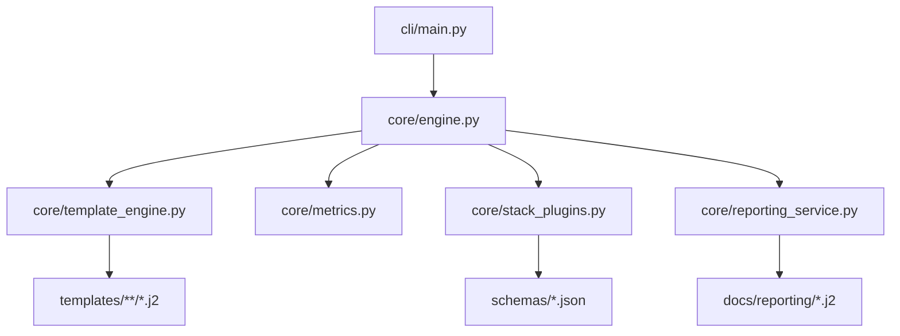

# Context Engineer — Main Usage Guide

> **Language Navigation / Navegação**
> - [English Reference](#english-reference)
> - [Referência em Português](#referencia-em-portugues)
>
> **Language note:** When you run `@Agente_PRD_360.md`, the agent now pauses to ask for the preferred language (EN-US or PT-BR) before generating the PRD+JSON. Keep both language versions of your inputs handy so you can mirror the user’s preference.

## English Reference

- Context Engineer transforms product ideas into production-ready code using PRDs, PRPs and executable Tasks guided by IDE prompts plus the `ce` CLI.
- Pick between the **Full Flow** (Idea → PRD → PRPs → Tasks → Code) or the **Simplified Flow** when you already have a formatted User Story.
- Sync prompts/workflows with `ce ide sync --project-dir .` (fallback: copy `IDE-rules` → `.ide-rules/`), configure `GLOBAL_ENGINEERING_RULES.json` and `PROJECT_STANDARDS.md`, and keep the diagram (`docs/assets/context_engineer_flow.mmd` or the PNG fallback) handy for onboarding.

### Quick Start
1. `ce init my-project --stack python-fastapi` or run the interactive wizard with `ce init --interactive`.
2. `ce ide sync --project-dir .` (fallback: `cp -r IDE-rules .ide-rules`) and configure `GLOBAL_ENGINEERING_RULES.json` + `PROJECT_STANDARDS.md`. The PRD agent now asks for the preferred language (EN-US/PT-BR) before producing outputs, so keep both versions of the docs accessible.

### Terminal interaction tracks
| Track | Command(s) | Purpose |
|-------|------------|---------|
| Conversational assistant | `ce assist --format text|html --open` | Reads project health, suggests patterns/cache entries and optionally invokes `ce init`, `ce generate-prd`, `ce generate-prps`, `ce generate-tasks`. |
| Review / inspection | `ce status`, `ce checklist`, `ce doctor`, `ce ai-governance status` | Read-only dashboards plus AI/ROI/git-hook diagnostics for governance ceremonies and leadership reviews. |
| Guided / automation | `ce wizard`, `ce autopilot`, `ce ci-bootstrap` | Wizard confirms each phase interactively, Autopilot resumes unattended pipelines, CI bootstrap wires `ce validate` + `ce report` into GitHub Actions. |
| Context & planning | `ce discuss <phase>`, `ce verify <phase>` | Capture decisions before planning; run verification/UAT after execution. |
| Project management | `ce state status`, `ce health [--repair]`, `ce session pause/resume` | Track state, diagnose project integrity, manage work sessions. |
| Git workflow | `ce commit task <id> <msg>`, `ce commit map` | Atomic commits per task and commit-to-task traceability. |

### Step-by-step (Full Flow)
1. **Step 0 – Setup**: run `ce ide sync --project-dir .` (fallback: copy `IDE-rules` → `.ide-rules`), configure rules/stack, ensure Python 3.11+ available.
2. **Step 0.5 – LLM Provider**: run `ce provider setup` to configure your LLM provider and model. Use `ce provider set-model <provider> <model>` to set a custom model (the name must match exactly what the provider's API expects).
3. **Step 1 – Generate PRD**: in IDE run `@Agente_PRD_360.md` with your product idea; outputs `PRD.md` + structured JSON.
4. **Step 2 – Generate PRPs**: run `@Agente_PRP_Orquestrador.md` referencing `prd_structured.json`; produces `PRPs/`, `TASKs/`, `execution_map.md`.
5. **Step 3 – Generate Tasks**: execute `@TASKs/TASK.FR-001.md` or `ce generate-tasks`; each task ships with instructions, code skeleton and tests.
6. **Validation & Metrics**: `ce validate`, `ce report`, `ce checklist`, `ce doctor`, `ce ai-governance status`, plus Git hooks for Soft-Gate governance.

### Simplified flow (User Story direct)
- Use `@Agente_Task_Direto.md` with persona/action/value plus Gherkin acceptance criteria.
- The agent outputs Task.md / Task.json / code suggestions; validate with `pytest`, `ruff`, `black`.

### Assets & references
- Diagram: `docs/assets/context_engineer_flow.mmd` (or `context_engineer_flow.png`).


- Quick reference: `docs/QUICK_REFERENCE.md`.
- Multi-IDE guidance: `docs/MULTI_IDE_USAGE_GUIDE.md`.
- AI governance details: `docs/AI_GOVERNANCE.md`.

### Release checklist (PyPI + GitHub Actions)
1. Run project validations: `pytest -q && ruff check .` (plus stack-specific linters).
2. Confirm AI stack health: `ce doctor --format table` and `ce ai-governance status --format table`.
3. Ensure prompts are current: `ce ide sync --project-dir .` (commit `.ide-rules/` if shared).
4. Review CI workflow with `ce ci-bootstrap --project-dir .` (regenerate when policies change).
5. Build/publish packages: `python -m build && twine upload dist/*`.
6. Tag and push: `git tag vX.Y.Z && git push --tags`.

---

## Referência em Português

### O que é o Context Engineer?

Framework estruturado para transformar **ideias de produto** em **código funcional** através de um processo linear e validado, utilizando **PRPs (Product Requirements Planning)** e agentes de IA especializados.
- Antes de qualquer interação, sincronize os prompts/workflows oficiais executando `ce ide sync --project-dir .` (alternativa: `cp -r IDE-rules .ide-rules`) para garantir que as referências `@` tragam a versão correta.

### Fluxos Disponíveis

#### Fluxo Completo (Recomendado para projetos novos)
```
Ideia → PRD → PRPs → Tasks → Código Funcional
```

#### Fluxo Simplificado (Quando você já tem UserStory) 
```
UserStory → Task → Código Funcional
```

**Escolha o fluxo simplificado se:**
- Você já tem UserStory formatada
- É uma feature isolada
- Quer implementação rápida sem PRD/PRPs

**Use o fluxo completo se:**
- Você tem apenas uma ideia
- Projeto grande/complexo
- Precisa de planejamento detalhado

### Checklist de Release (PyPI + GitHub Actions)
1. Execute validações locais: `pytest -q && ruff check .` (e linters específicos da stack).
2. Rode `ce doctor --format table` e `ce ai-governance status --format table` para garantir saúde da IA, ROI e hooks.
3. Garanta que os prompts/workflows estão atualizados com `ce ide sync --project-dir .` (versione `.ide-rules/` se compartilhado).
4. Revise/regenere o workflow com `ce ci-bootstrap --project-dir .` quando políticas mudarem.
5. Gere e publique pacotes: `python -m build && twine upload dist/*`.
6. Versione: `git tag vX.Y.Z && git push --tags`.

---

## Pré-requisitos

- **IDE IDE** instalado
- Python 3.11+ (para CLI opcional)
- Conhecimento básico de desenvolvimento de software

---

## Como Usar os Agentes no IDE

**Importante**: Você não precisa copiar e colar os prompts! Use referências diretas com `@`:

### Sintaxe Simples:
```
@nome-do-arquivo.md

Faça o processo descrito para [sua entrada aqui]
```

### Exemplos:
```
# Para gerar PRD
@Agente_PRD_360.md
Faça o processo descrito para a ideia: [sua ideia]

# Para gerar PRPs
@Agente_PRP_Orquestrador.md
Faça o processo descrito usando: @prd_structured.json

# Para executar Task
@TASKs/TASK.FR-001.md
Execute a task descrita acima.
```

**Vantagens**:
- Não precisa copiar/colar
- Sempre usa a versão mais atual do prompt
- Mais rápido e eficiente
- O IDE carrega automaticamente o arquivo

---

## Dois Modos de Uso

### Modo Simplificado: UserStory Direta (1 passo)

**Para quando você já tem UserStory formatada:**

1. **No IDE, use a referência direta**:
 ```
 @Agente_Task_Direto.md
 
 Faça o processo descrito para a seguinte UserStory:
 
 UserStory:
 Como um [persona]
 Eu quero [ação]
 Para que [valor]
 
 Critérios de Aceitação:
 - Dado que [condição]
 - Quando [ação]
 - Então [resultado]
 ```

2. **O agente gera automaticamente**:
 - `TASK.US-XXX.md` - Task completa
 - `TASK.US-XXX.json` - Configuração
 - Código implementado
 - Testes BDD

3. **Valide**:
 ```bash
 pytest -q
 ruff check .
 ```

 **Pronto!** Código funcional em minutos.

 **Veja mais detalhes**: Consulte a seção "Modo Simplificado" no final deste guia.

---

### Modo Completo: Processo em 4 Passos

**Para quando você tem apenas uma ideia:**

### Trilhas de uso no terminal

| Trilha | Comando(s) | Propósito | Quando usar |
|--------|------------|-----------|-------------|
| **Assistente conversacional** | `ce assist --format text`, `ce assist --format html --open` | Executa `ProjectStatusService` + `ProjectAnalyzer`, identifica lacunas de PRD/PRPs/Tasks, sugere padrões/cache e pode disparar `ce init`, `ce generate-prd`, `ce generate-prps`, `ce generate-tasks` na própria sessão. | Pareamentos, onboarding de novos devs, momentos de coaching dentro do terminal. |
| **Revisão/inspeção** | `ce status`, `ce checklist`, `ce doctor`, `ce ai-governance status` | Dashboards somente leitura com progresso das fases F0–F11, KPIs de governança, ROI de Context Pruning e status dos Git hooks. |
| **Automação completa** | `ce wizard`, `ce autopilot`, `ce ci-bootstrap` | Wizard confirma cada passo; Autopilot retoma pipelines sem supervisão; CI bootstrap integra `ce validate` + `ce report`. | Workshops guiados, execuções noturnas, guardrails de CI/CD reproduzíveis. |
| **Contexto e planejamento** | `ce discuss <fase>`, `ce verify <fase>` | Captura decisões antes do planejamento; executa verificação/UAT após execução. | Antes de cada fase de implementação. |
| **Gerenciamento de projeto** | `ce state status`, `ce health [--repair]`, `ce session pause/resume` | Rastreamento de estado, diagnóstico de integridade, gerenciamento de sessões. | Monitoramento contínuo. |
| **Fluxo Git** | `ce commit task <id> <msg>`, `ce commit map` | Commits atômicos por tarefa e rastreabilidade commit-tarefa. | Durante implementação. |

> Todas as trilhas respeitam `--ai / --no-ai` e as preferências de embedding definidas pelo AI Governance Service, mantendo buscas semânticas e dicas de cache alinhadas à política do projeto.

Para visualizar as correlações funcionais consulte `docs/assets/context_engineer_flow.mmd` (ou o PNG correspondente) em qualquer visualizador Mermaid.

## Passo a Passo Completo

### **PASSO 0: Setup Inicial** (5 minutos)

**Objetivo**: Configurar regras e padrões do projeto antes de gerar qualquer código.

#### 1. Sincronizar prompts oficiais com o CLI

```bash
# No diretório do seu projeto
ce ide sync --project-dir .

# Alternativa (fallback)
cp -r IDE-rules .ide-rules
```

#### 2. Configurar Regras Globais

Edite `.ide-rules/prompts/GLOBAL_ENGINEERING_RULES.json`:

```json
{
 "policies": {
 "language": {
 "explanations": "PT-BR",
 "code_comments_docstrings": "EN-US"
 },
 "performance_budgets": {
 "api_p95_ms": 200,
 "frontend_bundle_kb": 250
 },
 "security_privacy": {
 "lgpd_default": true,
 "no_pii_in_logs": true
 }
 }
}
```

#### 3. Definir Stack Tecnológica

Edite `.ide-rules/prompts/PROJECT_STANDARDS.md`:

```markdown
# PROJECT_STANDARDS
- Python: 3.11+, FastAPI, SQLModel, PyTest
- Vue 3: TypeScript, Pinia, Vite, Tailwind CSS
- JS/TS: Node 20, React+Tailwind, Vite
- Arquitetura: Clean Architecture (domain/app/infra/interfaces)
```

#### 4. Configurar Provedor LLM

```bash
# Setup interativo (recomendado)
ce provider setup

# Ou definir modelo customizado diretamente
ce provider set-model openai gpt-4-turbo
ce provider set-model local-ollama codellama:13b
```

> **Importante:** O nome do modelo deve ser idêntico ao identificador usado pela API do provedor. Consulte a documentação do provedor para nomes de modelos disponíveis.

#### Checklist Passo 0:
- [ ] `.ide-rules/` sincronizada via `ce ide sync` (ou cópia manual)
- [ ] `GLOBAL_ENGINEERING_RULES.json` configurado
- [ ] `PROJECT_STANDARDS.md` definido
- [ ] Stack tecnológica escolhida
- [ ] Provedor LLM configurado via `ce provider setup`

---

### **PASSO 1: Gerar PRD** (10-15 minutos)

**Objetivo**: Transformar sua ideia em documento de requisitos estruturado.

#### Como Executar:

1. **No IDE IDE**, use a referência direta ao agente:

 ```
 @Agente_PRD_360.md
 
 Faça o processo descrito para a seguinte ideia:
 
 Visão: "Aplicativo de gestão de tarefas para equipes remotas"
 Contexto: "Mercado de produtividade, concorrência com Asana/Trello"
 Usuários: "Gerentes de projeto, desenvolvedores, designers"
 Restrições: "LGPD compliance, performance < 200ms"
 ```

2. **O agente executará automaticamente** o processo completo descrito no prompt

#### Outputs Esperados:

```
projeto/
├── PRD.md # Documento legível para humanos
└── prd_structured.json # Dados estruturados (JSON)
```

#### Estrutura do PRD Gerado:

- Resumo Executivo & Problema
- Objetivos & Métricas de Sucesso
- Personas & Cenários de Uso
- Requisitos Funcionais (priorizados MoSCoW)
- Requisitos Não Funcionais
- UX & Fluxos
- Dados & Privacidade/LGPD
- Arquitetura de Alto Nível
- Riscos & Mitigações

#### Checklist Passo 1:
- [ ] `PRD.md` completo e revisado
- [ ] `prd_structured.json` válido
- [ ] Requisitos funcionais priorizados
- [ ] Critérios de aceitação definidos

---

### **PASSO 2: Gerar PRPs** (15-20 minutos)

**Objetivo**: Transformar PRD em plano de implementação faseado e executável.

#### Como Executar:

1. **No IDE IDE**, use a referência direta ao orquestrador:

 ```
 @Agente_PRP_Orquestrador.md
 
 Faça o processo descrito usando o PRD estruturado:
 
 @prd_structured.json
 ```

2. **O agente executará automaticamente** o processo completo de geração de PRPs

#### Outputs Esperados:

```
projeto/
├── PRPs/
│ ├── 00_plan.md/.json # F0 - Backlog e planejamento
│ ├── 01_scaffold.md/.json # F1 - Arquitetura e estrutura
│ ├── 02_data_model.md/.json # F2 - Modelo de dados
│ ├── 03_api_contracts.md/.json # F3 - Contratos de API
│ ├── 04_ux_flows.md/.json # F4 - Fluxos de UX
│ ├── 05_quality.md/.json # F5 - Testes e qualidade
│ ├── 06_observability.md/.json # F6 - Monitoramento
│ ├── 07_security.md/.json # F7 - Segurança
│ ├── 08_ci_cd_rollout.md/.json # F8 - CI/CD e deploy
│ └── openapi.yaml # Especificação da API
│
├── TASKs/
│ ├── TASK.FR-001.md/.json # Tarefa para cada requisito
│ ├── TASK.FR-002.md/.json
│ └── ...
│
└── execution_map.md # Ordem de execução das tasks
```

#### Estrutura de Cada PRP:

Cada PRP contém:
- **Contexto**: O que herda do PRD
- **Objetivo**: KPIs de sucesso específicos
- **Entradas**: Artefatos de fases anteriores
- **Saídas**: Arquivos, contratos, comandos
- **Procedimento**: Passo a passo executável
- **Critérios de Aceitação**: Checáveis automaticamente
- **Validações**: Scripts/comandos de validação

#### Checklist Passo 2:
- [ ] Todos os PRPs gerados (F0-F8)
- [ ] TASKs criadas para cada FR-*
- [ ] `execution_map.md` disponível
- [ ] `openapi.yaml` especificado (se aplicável)
- [ ] Dependências entre tasks mapeadas

---

### **PASSO 3: Implementar Tasks** (variável - depende do projeto)

**Objetivo**: Implementar código funcional tarefa por tarefa com validação automática.

#### Como Executar:

1. **Consulte a ordem de execução**:
 ```bash
 # Abra o arquivo de ordem de execução
 code execution_map.md
 ```

2. **Selecione a primeira task**:
 ```bash
 # Abra a task no IDE
 code TASKs/TASK.FR-001.md
 ```

3. **Execute a task no IDE**:
 ```
 @TASKs/TASK.FR-001.md
 
 Execute a task descrita acima seguindo todos os passos e validações.
 ```
 
 O agente lerá automaticamente o `.json` associado e executará a implementação completa

4. **Processo Automático**:

 ```
 Ler Objetivo → Analisar Entradas → Gerar Código → Executar Validação
 ↓
 Validação OK? → Sim → Tarefa Concluída
 ↓
 Não
 ↓
 Analisar Erro → Refatorar → Validar Novamente
 ```

5. **Validações Automáticas**:

 O agente executa automaticamente:
 ```bash
 pytest -q # Testes unitários
 ruff check . # Linting Python
 black --check . # Formatação Python
 # ou equivalentes para outras stacks
 ```

6. **Repetir para todas as tasks**:
 - Siga a ordem do `execution_map.md`
 - Execute cada task até todas estarem completas

#### Estrutura de uma TASK:

```json
{
 "task_id": "FR-001",
 "objective": "Implementar autenticação de usuário",
 "inputs": [
 "PRPs/01_scaffold.md",
 "PRPs/02_data_model.md",
 "PRPs/03_api_contracts.md"
 ],
 "artifacts": [
 {
 "path": "src/auth/service.py",
 "type": "file"
 }
 ],
 "validation": [
 {
 "tool": "tests",
 "command": "pytest tests/auth/ -q",
 "expected": "0 failures"
 }
 ],
 "acceptance_criteria": [
 "Usuário pode fazer login com email/senha",
 "Token JWT é gerado corretamente"
 ]
}
```

#### Checklist por Task:
- [ ] Código gerado conforme especificação
- [ ] Todos os testes passando
- [ ] Critérios de aceitação atendidos
- [ ] Validações automáticas OK (lint, format, tests)
- [ ] Documentação atualizada

---

### **PASSO 4: Validação Final** (10 minutos)

**Objetivo**: Garantir que todos os requisitos foram implementados e validados.

#### Checklist Final:

- [ ] Todas as TASKs executadas conforme `execution_map.md`
- [ ] Todos os FR-* implementados
- [ ] Testes de integração passando
- [ ] Cobertura de testes ≥ 80%
- [ ] Performance budgets respeitados (API p95 ≤ 200ms)
- [ ] Compliance LGPD validado
- [ ] Observabilidade implementada
- [ ] CI/CD configurado (se aplicável)
- [ ] Documentação completa

#### Comandos de Validação Final:

```bash
# Python/FastAPI
pytest -v --cov=src --cov-report=term-missing
ruff check . && black --check .
bandit -r src/ # Segurança

# Node/React
npm run test:coverage
npm run lint && npm run format:check
npm audit # Segurança

# Geral
openapi-spec-validator openapi.yaml # Validar API
```

---

## Estrutura de Pastas do Projeto

```
seu-projeto/
├── .IDE/ # Configurações do Context Engineer
│ ├── prompts/ # Prompts dos agentes
│ │ ├── Agente_PRD_360.md
│ │ ├── Agente_PRP_Orquestrador.md
│ │ ├── GLOBAL_ENGINEERING_RULES.json
│ │ └── PROJECT_STANDARDS.md
│ └── workflows/ # Templates de workflows
│
├── PRPs/ # Planos de implementação (gerado)
│ ├── 00_plan.md/.json
│ ├── 01_scaffold.md/.json
│ └── ...
│
├── TASKs/ # Tarefas individuais (gerado)
│ ├── TASK.FR-001.md/.json
│ └── ...
│
├── PRD.md # Documento de requisitos (gerado)
├── prd_structured.json # PRD estruturado (gerado)
└── execution_map.md # Ordem de execução (gerado)
```

---

## Arquitetura Visual


### Componentes Principais

1. **CLI Layer** – responsável por UX, comandos e integrações interativas (`cli/`).
2. **Core Engine** – orquestra TemplateEngine, MetricsCollector, EffortEstimator e integrações (`core/engine.py`, `core/template_engine.py`).
3. **Services Layer** – serviços especializados como Marketplace e Reporting (`core/marketplace_service.py`, `core/reporting_service.py`).
4. **Templates, Patterns e Stacks** – artefatos reusáveis que definem PRPs, tasks e estruturas (`templates/`, `patterns/`, `stacks/`).
5. **Metrics & Observability** – coleta, ROI tracking e dashboards (`core/metrics.py`, `core/reporting_service.py`, `docs/reporting`).

### Mapa de Imports (alto nível)



> Diagramas em SVG adicionais podem ser colocados em `docs/assets/` para expandir esta seção (ex.: fluxos de geração, pipelines de validação).

---

## Regras e Princípios Fundamentais

### Context Engineering

- **Camadas de Contexto**: System → Domain → Task → Interaction → Response
- **Loop Controlado**: Plan → Act → Observe → Refine
- **Saída Executável**: Sempre compatível com ferramentas de coding AI

### Qualidade por Design

- **Clean Architecture** obrigatória (domain/app/infra/interfaces)
- **SOLID** aplicado
- **DRY** (Don't Repeat Yourself)
- **TDD/BDD** quando aplicável

### Compliance Automático

- **LGPD** compliance por padrão
- **Segurança** by design
- **Observabilidade** completa
- **Performance budgets** respeitados

### Regras Críticas no IDE

1. **Busca Semântica Obrigatória**: Sempre pesquise o codebase antes de gerar código
2. **Validação Contínua**: Execute validações após cada mudança
3. **Documentação Automática**: Docstrings em inglês, explicações em PT-BR

---

## Performance Budgets

| Métrica | Limite | Como Validar |
|---------|--------|--------------|
| **API p95** | ≤ 200ms | `curl -w "@curl-format.txt"` |
| **Frontend Bundle** | ≤ 250KB | `npm run build --analyze` |
| **Cobertura de Testes** | ≥ 80% | `pytest --cov-report=term` |
| **Vulnerabilidades** | 0 críticas | `bandit -r src/` |
| **Linting Errors** | 0 | `ruff check .` |

---

## Comandos Úteis

### Setup Inicial
```bash
# Verificar estrutura
ls -la .IDE/prompts/
cat .IDE/prompts/GLOBAL_ENGINEERING_RULES.json | jq .
```

### Durante Execução
```bash
# Validações Python
pytest -q
ruff check .
black --check .

# Validações Node
npm run lint
npm run test

# Validar API
openapi-spec-validator PRPs/openapi.yaml
```

### Troubleshooting
```bash
# Ver logs estruturados
tail -f logs/app.json | jq .

# Executar testes com detalhes
pytest -v -s --tb=long
```

---

## Documentação Adicional

- **[QUICK_REFERENCE.md](QUICK_REFERENCE.md)** - Referência rápida de comandos
- **[PRP_BUSINESS_RULES.md](PRP_BUSINESS_RULES.md)** - Regras detalhadas dos PRPs
- **[IDE_EXAMPLES.md](IDE_EXAMPLES.md)** - Exemplos práticos por domínio

---

## ❓ Troubleshooting

### Problema: Agente não segue as regras
**Solução**: Verifique se `GLOBAL_ENGINEERING_RULES.json` está carregado e `PROJECT_STANDARDS.md` está atualizado

### Problema: Validações falhando
**Solução**: Execute comandos manualmente para debug:
```bash
pytest tests/ -v -s
ruff check . --show-source
```

### Problema: Código não segue Clean Architecture
**Solução**: Revise a estrutura de pastas e confirme separação de camadas (domain/app/infra/interfaces)

---

## Modo Simplificado: UserStory → Task Direto

### Quando Usar

Use este modo quando:
- Você **já tem UserStory formatada**
- É uma **feature isolada** ou pequena
- Quer **implementação rápida** sem planejamento extenso
- Projeto já existe e você quer adicionar uma funcionalidade

### Como Usar (1 Passo)

#### 1. No IDE, use o prompt direto:

```
@Agente_Task_Direto.md

UserStory:
Como um usuário autenticado
Eu quero fazer logout do sistema
Para que minha sessão seja encerrada com segurança

Critérios de Aceitação:
- Dado que estou logado no sistema
- Quando clico no botão "Sair"
- Então minha sessão é invalidada
- E sou redirecionado para a página de login
- E recebo uma mensagem de confirmação

Stack: Python/FastAPI
```

#### 2. O agente gera automaticamente:

```
projeto/
├── TASKs/
│ ├── TASK.US-001.md # Task completa
│ └── TASK.US-001.json # Configuração
│
└── [Código implementado]
 ├── src/domain/entities/
 ├── src/application/use_cases/
 ├── src/interfaces/api/
 └── tests/
```

#### 3. Valide:

```bash
pytest -q # Testes devem passar
ruff check . # Sem erros
black --check . # Formatação OK
```

### Exemplo Completo

**Input no IDE:**
```
@Agente_Task_Direto.md

UserStory:
Como um administrador
Eu quero visualizar lista de usuários
Para que eu possa gerenciar o acesso ao sistema

Critérios:
- Dado que estou autenticado como admin
- Quando acesso a página de usuários
- Então vejo lista paginada de usuários
- E posso filtrar por status (ativo/inativo)
- E posso buscar por nome ou email
```

**Output Gerado:**
- Task completa com passos de implementação
- Código de domínio, aplicação e interface
- Testes BDD em Gherkin
- Testes unitários
- Validações automáticas

### Vantagens do Modo Simplificado

1. **Mais rápido**: 1 passo vs 4 passos
2. **Direto ao ponto**: Foco na implementação
3. **Menos arquivos**: Não gera PRD/PRPs intermediários
4. **Flexível**: Funciona com UserStory já formatada

### Comparação: Modo Completo vs Simplificado

| Aspecto | Modo Completo | Modo Simplificado |
|---------|---------------|-------------------|
| **Tempo** | 30-60 minutos | 5-10 minutos |
| **Arquivos gerados** | PRD + PRPs + Tasks | Apenas Task |
| **Quando usar** | Projeto novo/grande | Feature isolada |
| **Planejamento** | Detalhado | Mínimo necessário |
| **Complexidade** | Alta | Baixa |

### Template de UserStory

Use este formato para garantir melhor resultado:

```markdown
UserStory:
Como um [persona específica]
Eu quero [ação clara e específica]
Para que [valor de negócio mensurável]

Critérios de Aceitação:
- Dado que [condição inicial]
- Quando [ação do usuário]
- Então [resultado esperado]
- E [resultado adicional se houver]

Stack: [python-fastapi/node-react/vue3/etc]
Prioridade: [MUST/SHOULD/COULD]
```

### Checklist Modo Simplificado

- [ ] UserStory formatada corretamente
- [ ] Critérios de aceitação em Gherkin
- [ ] Stack tecnológica definida
- [ ] Task gerada (`TASK.US-XXX.md` + `.json`)
- [ ] Código implementado
- [ ] Testes BDD passando
- [ ] Validações automáticas OK

---

---

## Funcionalidades Avançadas (CLI)

O Context Engineer agora inclui funcionalidades inteligentes para melhorar o planejamento e a qualidade:

### Estimativa Automatizada de Esforço

Estime story points automaticamente baseado em complexidade e histórico:

```bash
# Estimar esforço de uma task
ce estimate-effort TASKs/TASK.FR-001.json --stack python-fastapi --detailed
# ou: --stack node-react
# ou: --stack vue3

# Estimar batch de tasks
ce estimate-batch TASKs/ --stack python-fastapi --output estimates.json
# ou: --stack node-react
# ou: --stack vue3
```

**Como funciona:**
- Analisa complexidade (artefatos, passos, testes, dependências)
- Considera histórico do projeto (rework rate, completion rate)
- Ajusta por stack e categoria
- Retorna estimativas em escala Fibonacci (1, 2, 3, 5, 8, 13)

### Busca Semântica de Padrões

Encontre padrões de código relevantes usando busca semântica:

```python
from core.cache import IntelligenceCache

cache = IntelligenceCache("./.cache", use_embeddings=True)
patterns = cache.search_similar({
 "stack": ["python", "fastapi"],
 "requirements": ["authentication", "jwt"]
})
```

**Benefícios:**
- Encontra padrões mesmo com palavras diferentes
- Aprende com histórico de sucesso
- Funciona sem embeddings (fallback automático)

### Validação de Rastreabilidade Completa

Valide 100% de rastreabilidade PRD → Tasks:

```bash
# Validar com rastreabilidade completa
ce validate PRPs/ --prd-file prd_structured.json --tasks-dir TASKs/
```

**O que valida:**
- Todos MUST FRs têm Tasks correspondentes
- Acceptance criteria estão mapeados
- Tasks referenciam FRs válidos
- Sem FRs ou Tasks órfãos

### Templates Parametrizáveis

Templates Jinja2 para geração automática de fases:

```bash
# Templates disponíveis:
# - templates/base/phases/plan.md.j2 (F0)
# - templates/base/phases/scaffold.md.j2 (F1)
# - templates/base/phases/data_model.md.j2 (F2) NOVO
# - templates/base/phases/api_contracts.md.j2 (F3) NOVO
```

**Suporte multi-stack:**
- Python/FastAPI
- Node/React
- Extensível para outras stacks

---

## Próximos Passos

### Para Modo Simplificado:
1. Tenha sua UserStory formatada
2. Use `@Agente_Task_Direto.md` no IDE
3. Implemente e valide

### Para Modo Completo:
1. Execute o **Passo 0** (Setup Inicial)
2. Gere seu primeiro **PRD** (Passo 1)
3. Crie os **PRPs** (Passo 2)
4. Implemente as **Tasks** (Passo 3)
5. Valide o resultado final (Passo 4)

### Para Funcionalidades Avançadas:
1. Instale dependências:
 ```bash
 # Recomendado: usar uv (muito mais rápido)
 uv venv && source .venv/bin/activate
 uv pip install -r requirements.txt
 
 # Ou tradicional:
 python -m venv .venv && source .venv/bin/activate
 pip install -r requirements.txt
 ```
 Veja `SETUP_WSL.md` para setup completo com pyenv e uv
2. Use CLI para estimativas: `ce estimate-effort`
3. Valide rastreabilidade: `ce validate --tasks-dir`
4. Explore busca semântica no código Python

**Boa sorte com seu projeto! **

---

## Referências Adicionais

- **[MELHORIAS_IMPLEMENTADAS.md](MELHORIAS_IMPLEMENTADAS.md)** - Detalhes técnicos das melhorias
- **[QUICK_REFERENCE.md](QUICK_REFERENCE.md)** - Referência rápida de comandos
- **[PRP_BUSINESS_RULES.md](PRP_BUSINESS_RULES.md)** - Regras detalhadas dos PRPs

