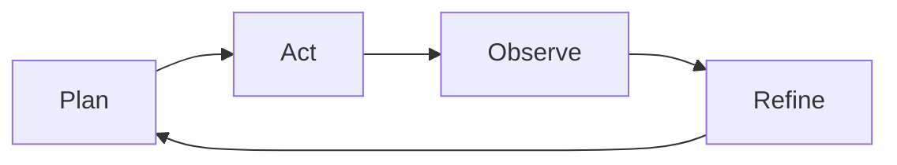

# PRPs - Regras de Negócio e Context Engineering

> **Language Navigation / Navegação**
> - [English Reference](#english-reference)
> - [Referência em Português](#referencia-em-portugues)

## English Reference

### Overview
- Explains how Product Requirements Planning (PRP) documents combine PRD context, curated code intelligence and executable runbooks for AI agents.
- Summarizes the core context layers (System, Domain, Task, Interaction, Response) and the controlled loop (Plan → Act → Observe → Refine).
- Details all PRP phases (F0–F9) with business rules, required artifacts and validation commands.

### How to use
1. Read the Portuguese section for full rules, JSON templates and command snippets.
2. Use the Mermaid diagram snippets to brief teams on the Plan→Act→Observe→Refine loop.
3. Keep `docs/assets/context_engineer_flow.mmd` / `.png` nearby to tie PRP phases back to the overall governance flow.

---

## Referência em Português

## Definição de PRP (Product Requirements Planning)

**PRP = PRD + Inteligência de Código Curada + Agent Runbook**

Um PRP é um documento executável que combina:
- **Contexto estruturado** do PRD
- **Inteligência de código** (snippets, APIs, padrões)
- **Runbook automatizável** para agentes de IA

---

## Arquitetura de Context Engineering

### Camadas de Contexto:

1. **System Context**: Regras globais, arquitetura, stack tecnológica
2. **Domain Context**: Regras de negócio, entidades, casos de uso
3. **Task Context**: Objetivos específicos, entradas, saídas
4. **Interaction Context**: Comandos, validações, critérios
5. **Response Context**: Artefatos, diffs, resultados

### Loop Controlado:



- **Plan**: Analisar contexto e definir objetivos
- **Act**: Executar comandos e gerar artefatos
- **Observe**: Validar resultados contra critérios
- **Refine**: Ajustar até todos os critérios passarem

---

## Fases dos PRPs e Regras de Negócio

### F0 - Alinhamento & Plano (`00_plan.md/.json`)

**Objetivo**: Derivar WBS (Work Breakdown Structure) do PRD

**Regras de Negócio**:
- Épicos → Features → Tasks (hierarquia obrigatória)
- Priorização MoSCoW (Must/Should/Could/Won't)
- Mapeamento de riscos para gates de validação
- Estimativas baseadas em complexidade e dependências

**Artefatos Obrigatórios**:
```json
{
 "backlog": [
 {
 "epic": "string",
 "features": ["string"],
 "priority": "MUST|SHOULD|COULD",
 "effort_points": "number",
 "dependencies": ["string"]
 }
 ],
 "risks": [
 {
 "risk": "string",
 "probability": "HIGH|MEDIUM|LOW",
 "impact": "HIGH|MEDIUM|LOW",
 "mitigation": "string",
 "gate": "string"
 }
 ]
}
```

### F1 - Arquitetura & Scaffolding (`01_scaffold.md/.json`)

**Objetivo**: Definir arquitetura e estrutura inicial do projeto

**Regras de Negócio**:
- Clean Architecture obrigatória (domain/app/infra/interfaces)
- Separação de responsabilidades (SOLID)
- Estrutura de pastas padronizada
- ADRs (Architecture Decision Records) documentados

**Comandos Executáveis**:
```bash
# Python/FastAPI
uv init --python 3.11
uv add fastapi sqlmodel pytest ruff black

# Node/React
npm create vite@latest . -- --template react-ts
npm install @tailwindcss/forms @headlessui/react

# Vue 3
npm create vue@latest . -- --typescript --router --pinia --vitest --eslint --prettier
npm install @tailwindcss/forms @headlessui/vue
```

**Estrutura Obrigatória**:
```
src/
├── domain/ # Entidades, value objects, regras de negócio
├── application/ # Casos de uso, serviços de aplicação
├── infrastructure/ # Repositórios, APIs externas, banco de dados
└── interfaces/ # Controllers, DTOs, adaptadores
```

### F2 - Modelo de Dados (`02_data_model.md/.json`)

**Objetivo**: Definir entidades, relacionamentos e esquemas

**Regras de Negócio**:
- Entidades do domínio primeiro (Domain-Driven Design)
- Normalização até 3NF mínimo
- Constraints de integridade obrigatórias
- Auditoria automática (created_at, updated_at, version)
- LGPD compliance (campos PII identificados)

**Validações Obrigatórias**:
```python
# Exemplo de entidade com regras de negócio
class User(BaseEntity):
 email: EmailStr = Field(unique=True, index=True)
 password_hash: str = Field(exclude=True) # Nunca expor
 created_at: datetime = Field(default_factory=datetime.utcnow)
 is_active: bool = Field(default=True)
 
 # LGPD: Campos PII identificados
 _pii_fields = ["email", "full_name", "phone"]
```

### F3 - APIs & Contratos (`03_api_contracts.md/.json`)

**Objetivo**: Especificar contratos de API com OpenAPI

**Regras de Negócio**:
- OpenAPI 3.0+ obrigatório
- Versionamento semântico (v1, v2, etc.)
- Rate limiting definido por endpoint
- Autenticação/autorização especificada
- Exemplos completos para cada endpoint
- Códigos de erro padronizados

**Estrutura de Resposta Padronizada**:
```json
{
 "success": true,
 "data": {},
 "meta": {
 "timestamp": "2024-01-01T00:00:00Z",
 "request_id": "uuid",
 "version": "v1"
 },
 "errors": []
}
```

**Performance Budgets**:
- API p95 ≤ 200ms
- Payload máximo: 1MB
- Rate limit: 1000 req/min por usuário

### F4 - UX Flows (`04_ux_flows.md/.json`)

**Objetivo**: Definir fluxos de usuário e componentes UI

**Regras de Negócio**:
- Happy path + edge cases obrigatórios
- Estados de loading/error/empty
- Acessibilidade WCAG 2.1 AA
- Responsividade mobile-first
- Internacionalização (i18n) preparada

**Componentes Obrigatórios**:
```typescript
// Exemplo de contrato de componente
interface ButtonProps {
 variant: 'primary' | 'secondary' | 'danger';
 size: 'sm' | 'md' | 'lg';
 loading?: boolean;
 disabled?: boolean;
 'aria-label': string; // Acessibilidade obrigatória
}
```

### F5 - Implementação Guiada (Tasks)

**Objetivo**: Quebrar cada FR-* em tarefas executáveis

**Regras de Negócio**:
- Uma TASK por requisito funcional
- Diffs completos e aplicáveis
- Snippets de código reutilizáveis
- Pitfalls e armadilhas documentados
- Validação automática obrigatória

**Estrutura de TASK**:
```json
{
 "task_id": "FR-001",
 "objective": "Implementar autenticação JWT",
 "inputs": ["PRPs anteriores"],
 "artifacts": [
 {
 "path": "src/auth/service.py",
 "type": "file",
 "diff": "--- a/file\n+++ b/file\n@@ -1,3 +1,7 @@"
 }
 ],
 "validation": [
 {
 "tool": "tests",
 "command": "pytest tests/auth/ -v",
 "expected": "100% pass"
 }
 ]
}
```

### F6 - Qualidade & Testes (`05_quality.md/.json`)

**Objetivo**: Garantir qualidade através de testes automatizados

**Regras de Negócio**:
- Cobertura mínima: 80% para código crítico
- Testes unitários, integração e contrato
- Linting e formatação obrigatórios
- Testes de performance para APIs críticas
- Testes de segurança automatizados

**Pirâmide de Testes**:
```
 /\
 / \ E2E (poucos)
 /____\
 / \ Integration (alguns)
 /________\
 / \ Unit (muitos)
 /__________\
```

### F7 - Observabilidade (`06_observability.md/.json`)

**Objetivo**: Implementar monitoramento e analytics

**Regras de Negócio**:
- Logs estruturados em JSON
- Tracing OpenTelemetry obrigatório
- Métricas de negócio rastreáveis
- Alertas baseados em SLOs
- Dicionário de eventos de produto

**Eventos Obrigatórios**:
```json
{
 "event_type": "user_action",
 "timestamp": "2024-01-01T00:00:00Z",
 "user_id": "uuid",
 "session_id": "uuid",
 "action": "login_success",
 "properties": {
 "method": "email",
 "duration_ms": 150
 },
 "context": {
 "user_agent": "string",
 "ip_hash": "sha256" // LGPD: IP hasheado
 }
}
```

### F8 - Segurança & Compliance (`07_security.md/.json`)

**Objetivo**: Implementar segurança e compliance LGPD

**Regras de Negócio**:
- Análise STRIDE obrigatória
- Secrets nunca em código
- LGPD compliance por design
- Criptografia para dados sensíveis
- Políticas de acesso baseadas em roles

**LGPD Checklist**:
- [ ] Finalidade documentada para cada dado
- [ ] Base legal identificada
- [ ] Retenção definida e automatizada
- [ ] Direitos do titular implementados
- [ ] PII nunca em logs
- [ ] Consentimento granular quando necessário

### F9 - CI/CD & Rollout (`08_ci_cd_rollout.md/.json`)

**Objetivo**: Automatizar deploy e rollout

**Regras de Negócio**:
- Gates de qualidade obrigatórios
- Feature flags para rollout gradual
- Rollback automático em caso de erro
- Ambientes isolados (dev/staging/prod)
- Monitoramento pós-deploy

**Pipeline Obrigatório**:
```yaml
stages:
 - lint_and_format
 - unit_tests
 - integration_tests
 - security_scan
 - build
 - deploy_staging
 - contract_tests
 - deploy_production
 - smoke_tests
```

---

## Regras Críticas de Context Engineering

### 1. Especificidade > Generalidade
- Sem "achismos" ou suposições
- Tudo verificável e mensurável
- Critérios objetivos de aceitação

### 2. Loop de Validação Contínua
```bash
# Executar após cada mudança
pytest -q # Testes passando
ruff check . # Linting OK
black --check . # Formatação OK
contract-tests run # Contratos válidos
```

### 3. Inteligência de Código Curada
- Snippets oficiais das bibliotecas
- Padrões do projeto documentados
- Exemplos concretos e testados
- Referências a documentação oficial

### 4. Rastreabilidade Completa
- Cada linha de código rastreável ao requisito
- Decisões arquiteturais documentadas (ADRs)
- Changelog automático por operação
- Versionamento semântico

---

## Comandos de Validação por Fase

### F0 - Plano:
```bash
# Validar estrutura do backlog
jq '.backlog[] | select(.priority == "MUST")' 00_plan.json
```

### F1 - Scaffold:
```bash
# Validar estrutura de pastas
find src/ -type d | grep -E "(domain|application|infrastructure|interfaces)"
```

### F2 - Data Model:
```bash
# Validar migrações
alembic check
pytest tests/models/ -v
```

### F3 - API Contracts:
```bash
# Validar OpenAPI
openapi-spec-validator openapi.yaml
pytest tests/contracts/ -v
```

### F4 - UX Flows:
```bash
# Validar componentes
npm run type-check
npm run test:components
```

### F5 - Tasks:
```bash
# Validar implementação
pytest tests/ -v --cov=src --cov-report=term-missing
```

### F6 - Quality:
```bash
# Validar qualidade
ruff check . && black --check . && pytest -v
```

### F7 - Observability:
```bash
# Validar logs e métricas
curl -s /health | jq .
curl -s /metrics | grep -E "(api_duration|error_rate)"
```

### F8 - Security:
```bash
# Validar segurança
bandit -r src/
safety check
```

### F9 - CI/CD:
```bash
# Validar pipeline
github-actions-validator .github/workflows/
```

---

## Métricas de Sucesso

### Por Fase:
- **F0**: 100% dos épicos priorizados
- **F1**: Estrutura Clean Architecture validada
- **F2**: 0 violações de constraints
- **F3**: 100% dos endpoints documentados
- **F4**: Todos os fluxos com happy/edge cases
- **F5**: 100% das TASKs com validação passando
- **F6**: Cobertura ≥ 80% + 0 linting errors
- **F7**: Todos os eventos rastreáveis
- **F8**: 0 vulnerabilidades críticas
- **F9**: Deploy automatizado funcionando

### Globais:
- **Performance**: API p95 ≤ 200ms
- **Bundle**: Frontend ≤ 250KB
- **Qualidade**: 0 bugs críticos em produção
- **LGPD**: 100% compliance auditável

---

## Anti-Patterns e Pitfalls

### Evitar:
- PRPs genéricos sem contexto específico
- Validações manuais (tudo deve ser automatizável)
- Código sem testes
- Decisões arquiteturais não documentadas
- PII em logs ou métricas
- Secrets em código
- Deploy sem rollback
- APIs sem versionamento

### Fazer:
- PRPs específicos e executáveis
- Validação automática contínua
- TDD/BDD quando aplicável
- ADRs para decisões importantes
- LGPD by design
- Secrets em vault
- Feature flags para rollout
- Contratos de API versionados

---

## Conclusão

Os PRPs representam uma evolução na engenharia de software, combinando:
- **Context Engineering** estruturado
- **Automação** de validação
- **Qualidade** por design
- **Compliance** automático
- **Observabilidade** completa

Seguindo estas regras de negócio, você terá um processo previsível e de alta qualidade para transformar ideias em código funcional.

---

## Referências de Código / Code References

Esta seção mapeia as regras de negócio e fases dos PRPs descritas neste documento para os módulos de implementação correspondentes no codebase.

### Módulos Core

| Componente | Arquivo | Descrição | Linhas Relevantes |
|------------|---------|-----------|-------------------|
| **PRP Validator** | `core/validators.py` | Valida consistência, rastreabilidade e dependências entre PRPs, PRD e Tasks | Classe `PRPValidator` |
| **Context Engine** | `core/engine.py` | Orquestra geração de PRD, PRPs e Tasks; gerencia templates e padrões | Métodos `generate_prd`, `generate_prps`, `generate_tasks` |
| **Template Engine** | `core/template_engine.py` | Renderiza templates Jinja2 para cada fase (F0-F9) com contexto do PRD | Método `render_template` |
| **Metrics Collector** | `core/metrics.py` | Coleta métricas de story points, rework rate, completion rate | Métodos `record_*`, `get_project_metrics` |
| **Effort Estimator** | `core/planning.py` | Estima esforço de tasks baseado em complexidade e histórico | Classe `EffortEstimator` |

### Comandos CLI

| Comando | Arquivo | Função Principal | Descrição |
|---------|---------|------------------|-----------|
| `ce generate-prps` | `cli/commands/generation.py` | `generate_prps()` | Gera PRPs a partir do PRD estruturado, respeitando fases F0-F9 |
| `ce generate-tasks` | `cli/commands/generation.py` | `generate_tasks()` | Cria tasks executáveis a partir dos PRPs ou via User Story |
| `ce validate` | `cli/commands/generation.py` | `validate()` | Executa validação profunda de rastreabilidade e contratos |
| `ce autopilot` | `cli/commands/autopilot.py` | `autopilot()` | Orquestra pipeline completo PRD→PRPs→Tasks |

### Templates e Schemas

| Recurso | Localização | Propósito |
|---------|-------------|-----------|
| **Templates de Fases** | `templates/base/phases/*.j2` | Templates Jinja2 para cada fase (F0-F9) |
| **Schema de PRPs** | `schemas/prp-phase-schema.json` | JSON Schema para validação de estrutura dos PRPs |
| **Schema de Tasks** | `schemas/task-schema.json` | JSON Schema para validação de estrutura das Tasks |
| **Plugins de Stack** | `stacks/*.yaml` | Definições de stacks suportadas (Python, Node, Go, Vue) |

### Fluxo de Execução

```
User → CLI Command (cli/commands/generation.py)
       ↓
       Context Engine (core/engine.py)
       ↓
       Template Engine (core/template_engine.py) → Templates (templates/base/phases/*.j2)
       ↓
       PRP Validator (core/validators.py) → Schemas (schemas/*.json)
       ↓
       Metrics Collector (core/metrics.py)
```

### Exemplos de Uso Programático

**Gerar PRPs via API:**
```python
from core.engine import ContextEngine

engine = ContextEngine(use_transformers=True)
result = engine.generate_prps(
    prd_file="prd/prd_structured.json",
    output_dir="./prps"
)
```

**Validar Rastreabilidade:**
```python
from core.validators import PRPValidator

validator = PRPValidator()
result = validator.validate_traceability(
    prps_dir="./prps",
    prd_file="prd/prd_structured.json",
    tasks_dir="./tasks"
)
```

**Estimar Esforço:**
```python
from core.planning import EffortEstimator

estimator = EffortEstimator()
estimate = estimator.estimate_task(
    task_file="tasks/TASK.FR-001.json",
    stack="python-fastapi"
)
```

### Extensibilidade

Para adicionar novas fases ou customizar o comportamento:

1. **Nova Fase PRP**: Crie template em `templates/base/phases/XX_nome.md.j2`
2. **Nova Stack**: Adicione arquivo YAML em `stacks/` seguindo `schemas/stack_plugin.schema.yaml`
3. **Novo Validador**: Estenda `PRPValidator` em `core/validators.py`
4. **Nova Métrica**: Adicione método em `MetricsCollector` (`core/metrics.py`)

### Documentação Relacionada

- **Implementação**: Consulte `cli/commands/generation.py` para ver como os comandos CLI invocam os serviços core
- **Testes**: Veja `tests/test_validators.py` e `tests/test_engine.py` para exemplos de uso
- **Arquitetura**: Diagrama completo em `docs/assets/context_engineer_flow.mmd` (ou `.png`)
