# Context Engineer - CLI Workflow Diagrams

This document contains Mermaid diagrams visualizing the Context Engineer CLI workflows.

---

## Complete Pipeline Flow

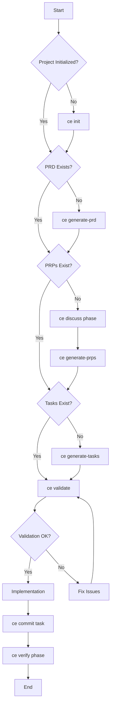

---

## Autopilot Mode Flow

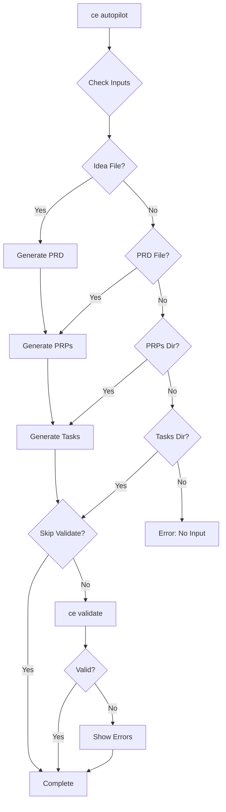

---

## Assistant/Wizard Flow

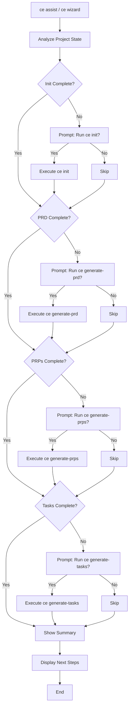

---

## Validation Flow

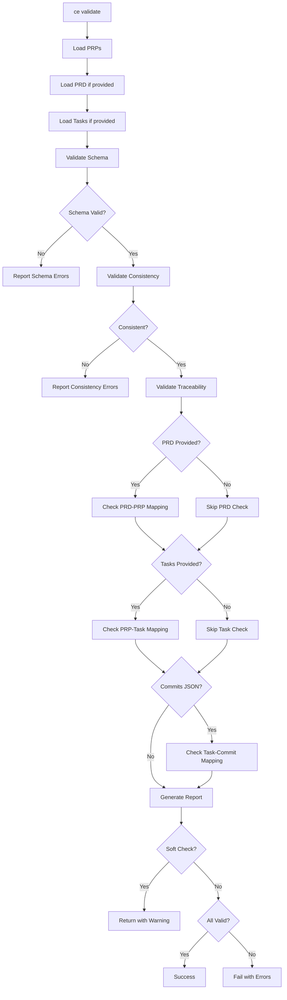

---

## AI Governance Decision Flow

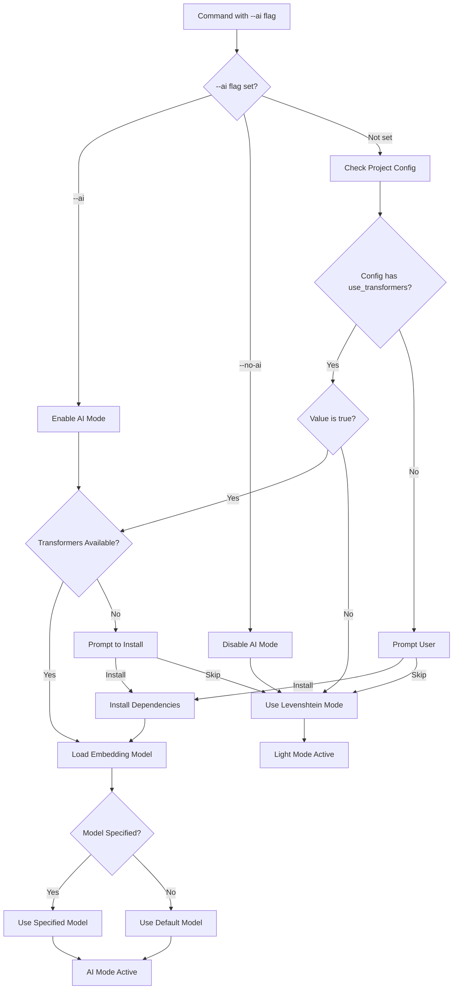

---

## Marketplace Installation Flow

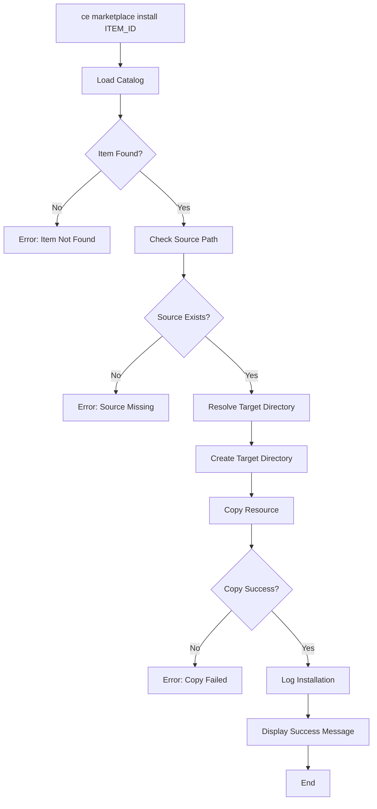

---

## Pattern Suggestion Flow

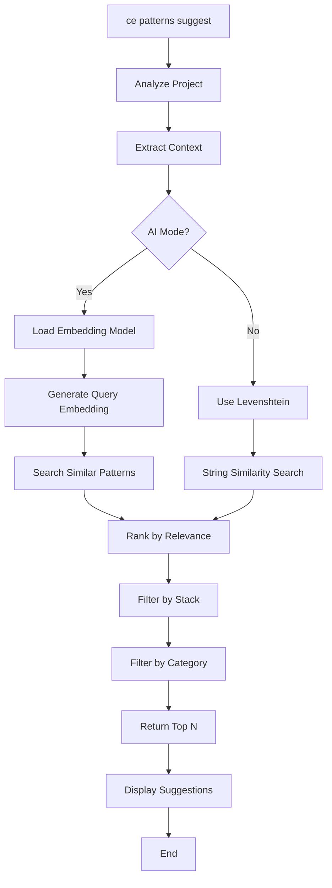

---

## Git Hooks Flow (Soft-Gate)

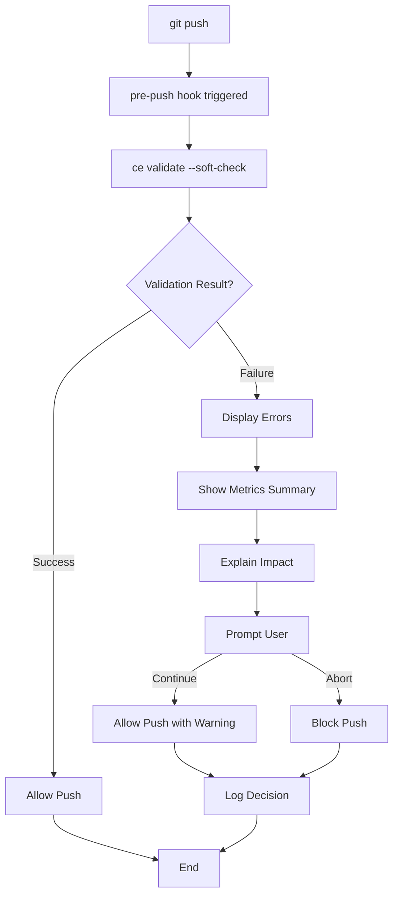

---

## CI/CD Bootstrap Flow

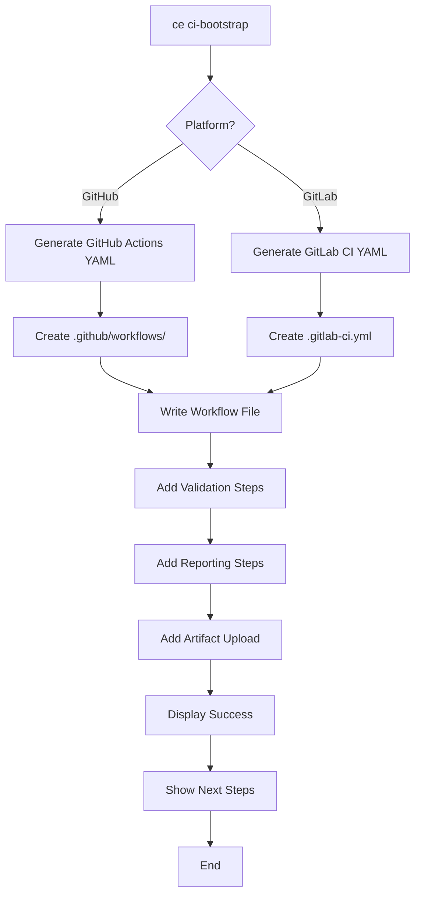

---

## IDE Sync Flow

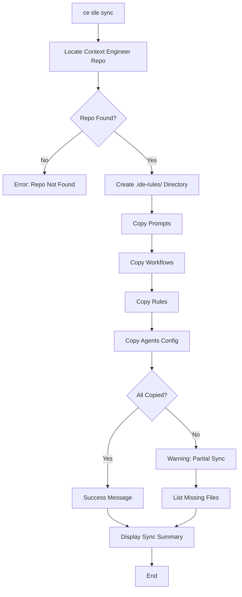

---

## Context Capture Flow

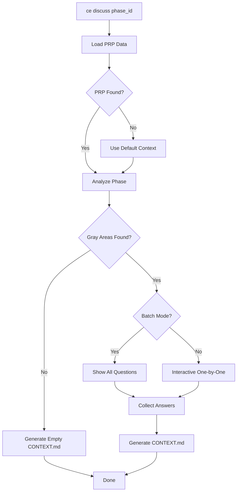

---

## Health Check & Repair Flow

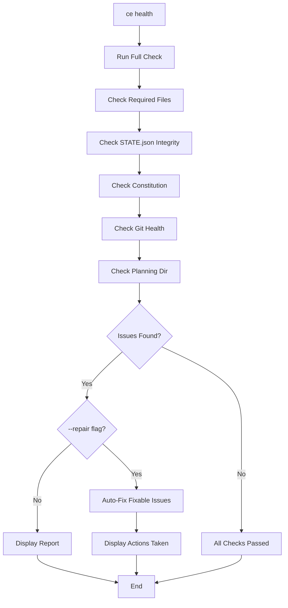

---

## Session Management Flow

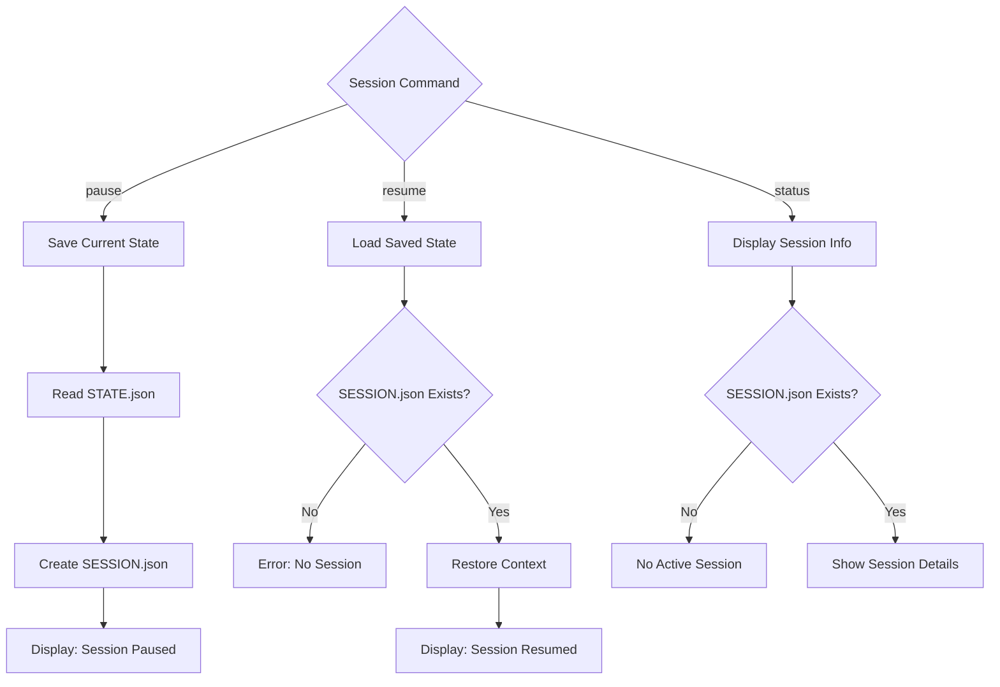

---

## Wave-Based Task Execution Flow

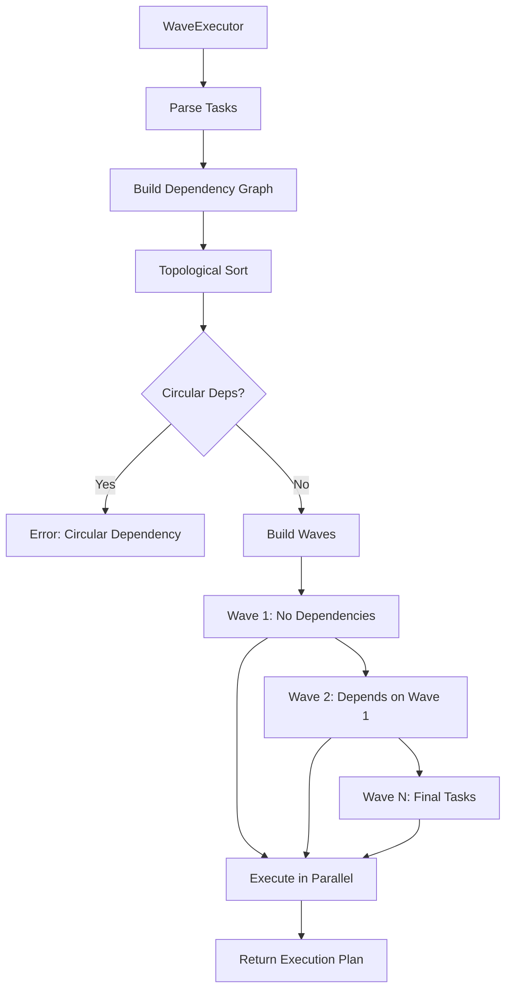

---

## Verification & UAT Flow

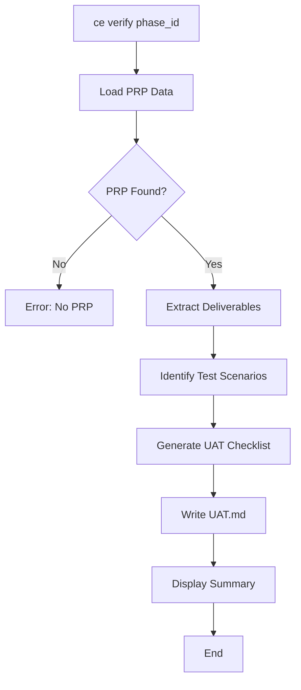

---

## Usage Instructions

To render these diagrams:

1. **In Markdown Viewers:**
   - GitHub, GitLab, and most modern Markdown viewers support Mermaid natively
   - Simply view this file in the web interface

2. **In VS Code:**
   - Install "Markdown Preview Mermaid Support" extension
   - Open this file and use Markdown preview

3. **Generate PNG/SVG:**
   ```bash
   # Using mermaid-cli
   npm install -g @mermaid-js/mermaid-cli
   mmdc -i cli-workflow-diagram.md -o cli-workflow-diagram.png
   ```

4. **Online Editor:**
   - Visit https://mermaid.live/
   - Copy and paste any diagram code

---

## Diagram Legend

- **Rectangle**: Process or action
- **Diamond**: Decision point
- **Rounded Rectangle**: Start/End point
- **Arrow**: Flow direction
- **Dashed Line**: Optional path
- **Bold Line**: Primary path

---

**Version:** 1.2  
**Last Updated:** 2026-03-13  
**Maintainer:** Context Engineer Team
